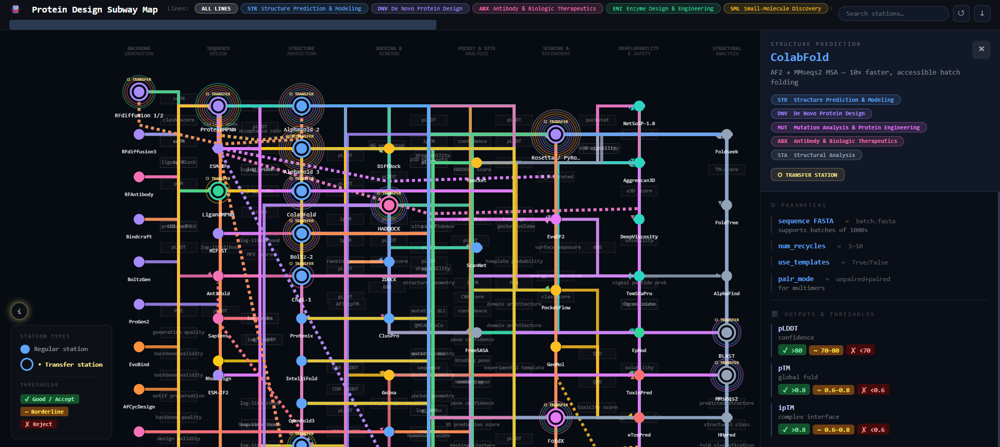

# Protein Design Subway Map

An interactive map of the protein design and extended computational protein engineering ecosystem.

**[Open the Interactive Map](https://srikanth-lingappa.github.io/protein-design-subway-map/)**

## Overview

Modern protein design often involves stitching together multiple computational tools, including backbone generators, sequence designers, structure predictors, docking methods, developability analysis, and other downstream approaches.

The **Protein Design Subway Map** provides a visual way to navigate this increasingly complex landscape as a set of interconnected workflows.

Inspired by the London Underground, the map represents the protein design ecosystem as a subway network:

* **Stations** represent individual tools or methods.
* **Tracks** represent connections between tools within a workflow.
* **Transfer stations** represent tools that can be used across multiple workflows.
* **Track metrics** represent decision criteria, thresholds, or other considerations that can help determine when to progress to the next stage.

## What the Map Contains

The current map covers:

* **8 major stages**
* **11 workflow categories**
* **118 tools**

The stages span a broad range of protein design and related computational tasks, including structure prediction, protein generation, sequence design, protein–protein interaction design, protein–ligand design, peptide design, structural analysis, and developability-related analysis.

The map is intended to evolve as new methods and tools are developed.

## Exploring the Map

The interactive map allows you to:

* Select individual workflows
* Explore alternative routes through a workflow
* Search for individual tools
* Explore connections between tools
* Inspect workflow inputs and outputs
* Examine decision criteria and thresholds between stages
* Identify tools that are shared across different workflows

The map is a visual guide to help explore different protein design workflows and tools. Different design problems may require different routes, tools, or combinations of methods.

## Use for Protein Design and Agentic Systems

The map is intended to help researchers navigate and reason about computational protein design decisions.

It may also provide a useful conceptual framework for **agentic protein design systems**, where an agent needs to select and connect computational tools according to design requirements, molecular context, constraints, intermediate results, and desired outcomes.

## Using the Map

The map runs directly in a modern web browser and requires no installation.

It is designed to work on both desktop and mobile devices, although the desktop experience provides more space for exploring the full map.

## Accuracy and Limitations

Most of the tools, data, parameters, and connections in the map have been manually reviewed for accuracy. However, the protein design ecosystem is evolving rapidly, and the map may contain errors, outdated information, or omissions.

The map should therefore be treated as a starting point for exploration rather than a definitive reference. Users should verify individual tools, methods, parameters, and decision criteria against the relevant scientific publications and documentation before applying them to research.

## Development

The concept and overall idea for the Protein Design Subway Map were developed by the author. The interactive map was then created with direct assistance from large language models (LLMs), based on the author's specifications and ideas.

The resulting tools, data, parameters, workflow connections, and other content have been manually reviewed for accuracy. However, some errors or omissions may remain.

Contributions, corrections, and suggestions for improvement are welcome.

## Sources and Attribution

The map was developed using information from publicly available scientific publications, preprints, technical documentation, and resources associated with the tools and methods represented in the map.

Individual tools and methods remain the work of their respective authors and developers.

The Protein Design Subway Map is an independent project and is not affiliated with the developers or authors of the individual tools.

Because the map was generated with substantial assistance from LLMs, the source information and scientific content should be independently verified against the original publications and documentation, particularly before using the map to make research decisions.

If you identify an incorrect reference, tool description, parameter, workflow connection, or other information, please open an issue or submit a pull request.

## Contributing

Suggestions, corrections, additional tools, workflow improvements, and other contributions are welcome.

If you identify an error or omission, please open an issue or submit a pull request.

## License

This project is released under the [MIT License](LICENSE).

## Citation

If you use the Protein Design Subway Map in research, teaching, presentations, software development, or other work, please cite the project.

A DOI will be added following the first archived release on Zenodo.

